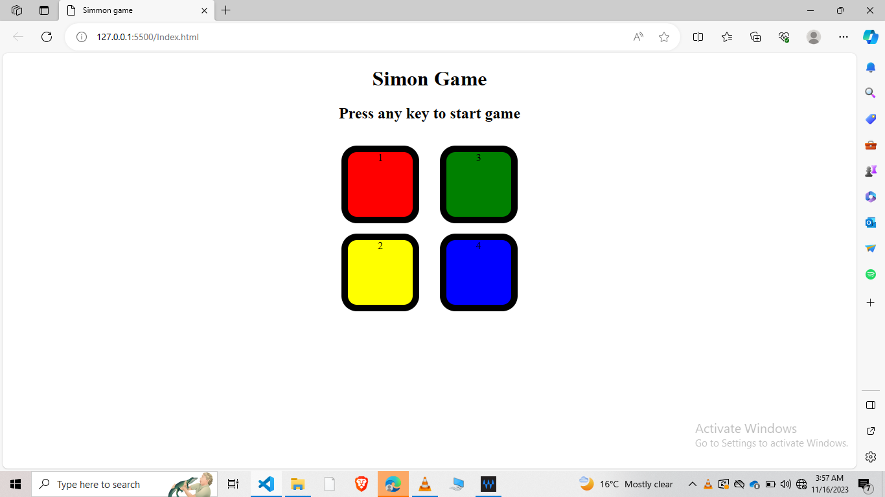

==>Hey Everyone!,

-->Today I learn about some medium level concept of javascript .Like add DOM,eventlistner,buttons,classes,callback and when user click i that button what happen like this.so,I have made a small Game Project in which it name like simon's game .

-->There are four boxes given user has to click on any box to start the game as soon as user keypress any box game starts.

-->when game start level shows incresing and at what box you will click it flashes and you have to identify which box flashes and you have to just click on it as soon as if you will win .if you will not be able to select the box which flash at that time the Game is over start again.

-->Here's an image:-

